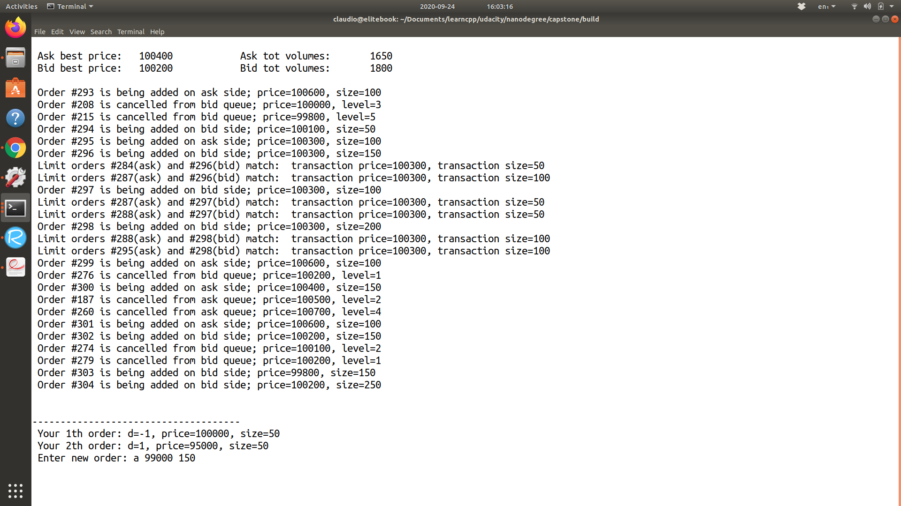

# SIMULOB - A simulator for order-driven markets

##Overview
The project consists in the implementation of a simulator of a Limit Order Book ([https://www.investopedia.com/terms/o/order-book.asp](https://www.investopedia.com/terms/o/order-book.asp)).
Prices are reported as integers, so you might think of 10^-2 US$ as the unit of accounting: a reported price of 100 amounts to 1US$. The unit of volumes can be assumed to be the number of shares. 

 Orders arrive to the trading venue following a two-dimensional Hawkes process ([https://mathworld.wolfram.com/HawkesProcess.html](https://mathworld.wolfram.com/HawkesProcess.html)).
The simulation of the two-dimensional Hawkes process is done via Ogata's thinning algorithm. 

The user interface is implemented in a way that the user can send orders from the console, hence dynamically affecting the state of the Limit Order Book.  

Notes:
Construction and compilation utilize [Make](https://www.gnu.org/software/make/), and c++17 is set as standard.
The GUI utilizes [ncurses](https://www.gnu.org/software/ncurses/). 

## Make
This project uses [Make](https://www.gnu.org/software/make/). The Makefile has four targets:

* `build` compiles the source code and generates an executable

* `format` applies [ClangFormat](https://clang.llvm.org/docs/ClangFormat.html) to style the source code

* `debug` compiles the source code and generates an executable, including debugging symbols

* `clean` deletes the `build/` directory, including all of the build artifacts

Notice that the file `./CMakeList` sets c++17 as standard.

## Build instructions
Make sure that  [ncurses](https://www.gnu.org/software/ncurses/) is installed and available. If not installed, a one-line fixer could be
`sudo apt-get install libncurses5-dev libncursesw5-dev`.
Make sure that you can compile with the flag -std++17. Recommended compiler is g++ version 8 or later.
From the command line, navigate to the current directory, i.e. `capstone/`. 
Then, type `make build`. 
The executable `lob` will be created in the directory `./build/`. 

##User commands
When the simulator is running, the user can submit Ask orders, submit Bid orders, interrupt the simulation:

* Submission of Ask orders. The format of the command is `a [price level] [size]`. For example, type `a 100000 50` and press enter to submit an ask limit order for 50 shares at a price not smaller than  $1000.00 per share.
 
* Submission of Bid orders. The format of the command is `b [price level] [size]`. For example, type `b 95000 50` and press enter to submit a bid limit order for 50 shares at a price not larger than  $950.00 per share. 
* Interrupt simulation. Press `F1`.
